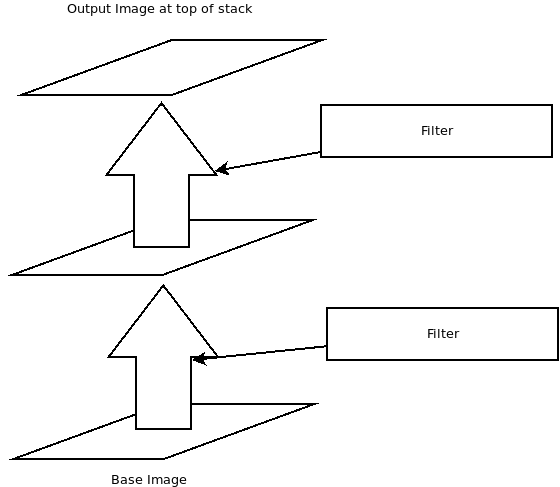
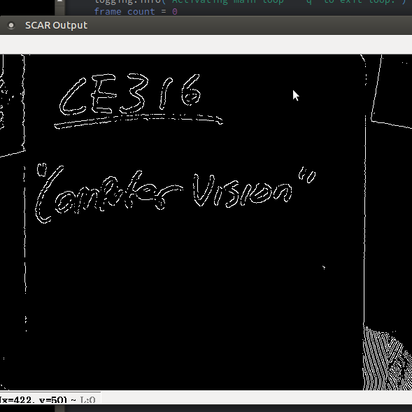

# SCAR
## Stacked Control Augmented Reality

This is a very simple proof of concept of something that I wound up not using in my dissertation.

## Harness

We have a harness, in which we have the input at the bottom of the stack. This image at the bottom can be continually updated; with simple filters, such as the included face_detect filter, this can run at video rate, even before using any threading techniques.

## Filters

By having a filter class that can be extended, we can create new filters quickly and easily; all we have to do is modify the `apply_control()` method. There's absolutely nothing stopping us from modifying the class further by adding a second input. There are some demonstration filters included; the filter shown in the photo is the `canny.py` filter, which uses a Canny edge detector.

In this particular example, there are two filters: there's the Grayscale filter, and on top of that, there's the Canny edge detector filter.

## Performance

At the moment, this particular implementation is slow, because it's using Python and it's also not multithreaded. The demonstration CLI is slow when the harnesscontains more filters, because we're reading in the webcam feed in the same thread as the the harness and the filters.

## Try For Yourself

- You will need OpenCV, NumPy, and a copy of a Haar Cascade for facial detection.

- Run `python3 scar-cli.py` from this directory.

- For build management, use the provided `Makefile`.

